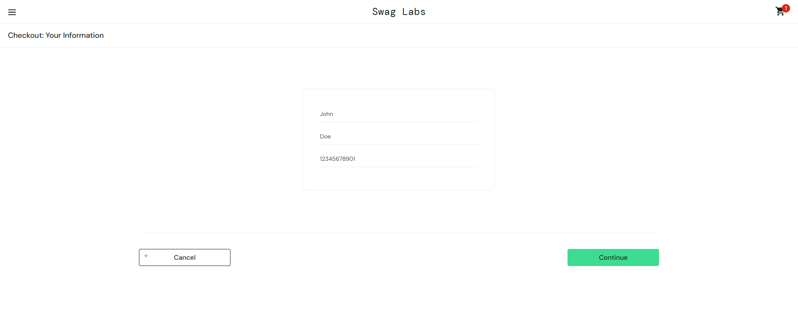
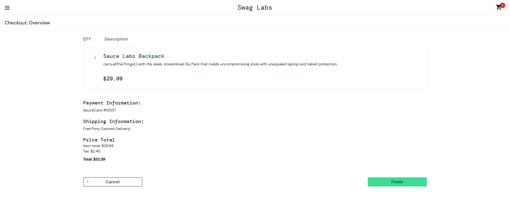

# Bug Report Example

**ID:** BUG-001  
**Title:** [Checkout] Postal Code field accepts more than 10 digits  
**Reported by:** QA Analyst  
**Date:** 2025-04-19  
**Status:** New

**Environment:**  
- Browser: Chrome 123  
- OS: Windows 11  
- URL: https://www.saucedemo.com/checkout-step-one.html

**Preconditions:**  
- User logged in  
- At least one product in the cart  
- On checkout page

**Steps to Reproduce:**  
1. Add a product to the cart  
2. Proceed to checkout  
3. Enter a valid first name and last name  
4. Enter a postal code with 12 digits (e.g., 123456789012)  
5. Click "Continue"

**Actual Result:**  
- The system accepts the postal code and proceeds to the next step.

**Expected Result:**  
- The system should display an error: "Postal Code is invalid" for codes longer than 10 digits.

**Evidence:**  

**Empty Cart**

**Cart with Item**

**Checkout Page**

**Severity:** Minor  
**Priority:** Medium

**Additional Notes:**  
- This allows invalid data to be submitted and may affect order delivery.