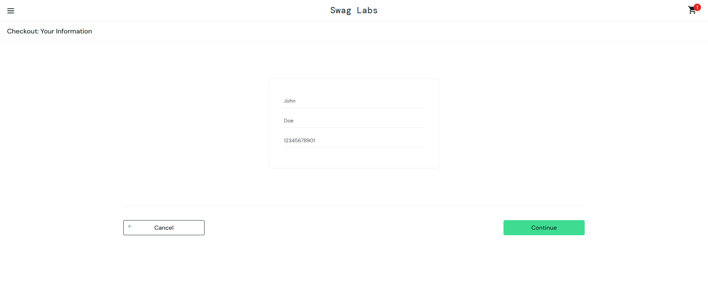

# Defect Life Cycle Example – Postal Code Validation Bug

## Defect ID:
BUG-001

## Related Requirement:
FR09 - System must validate required fields during checkout

## Title:
System accepts invalid Postal Code during checkout

## Description:
During the checkout process, the system allows the user to proceed with an invalid Postal Code (more than 10 digits), which violates the validation requirement.

## Steps to Reproduce:
1. Login as a valid user (`standard_user` / `secret_sauce`)
2. Add any product to the cart
3. Go to cart and click "Checkout"
4. Enter valid First Name and Last Name
5. Enter an invalid Postal Code (e.g., `12345678901`)
6. Click "Continue"

## Expected Result:
The system should display an error message and prevent the user from proceeding.

## Actual Result:
The system allows the user to proceed to the next step with an invalid Postal Code.

## Defect Life Cycle:

| Status    | Description                                  | Responsible      | Date         | Notes                      |
|-----------|----------------------------------------------|------------------|--------------|----------------------------|
| New       | Defect reported by QA                        | QA               | 2025-04-25   |                            |
| Assigned  | Defect assigned to developer                 | QA Lead          | 2025-04-25   |                            |
| Open      | Developer starts investigating the defect    | Developer        | 2025-04-26   |                            |
| (Pending) | Awaiting fix from development team           | Developer        | 2025-04-26   | Bug not yet fixed          |

## Comments:
- The defect was found during boundary value analysis for the Postal Code field.
- As of this report, the bug remains open and has not been fixed in the Sauce Demo environment.

## Evidence

### Bug Still Present
**Empty Cart**

**Cart with Item**

**Checkout Page**

