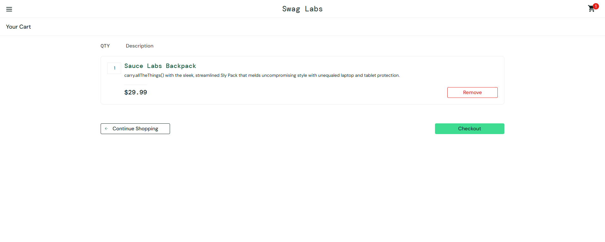
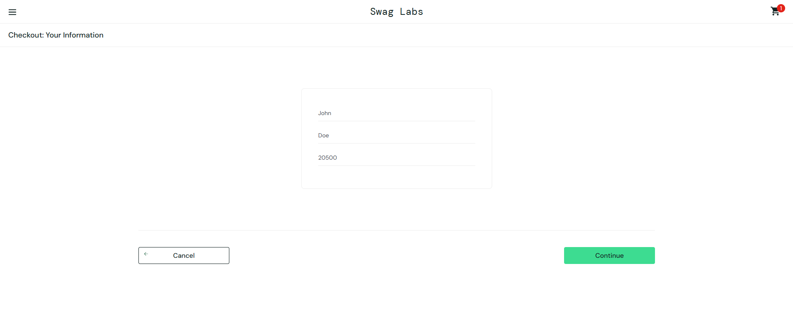
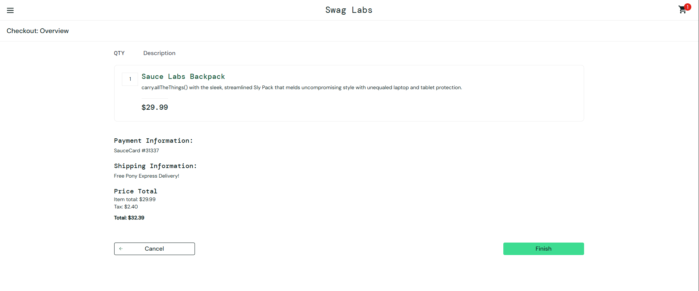
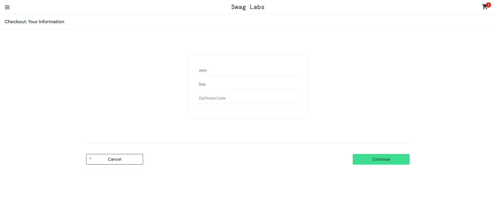
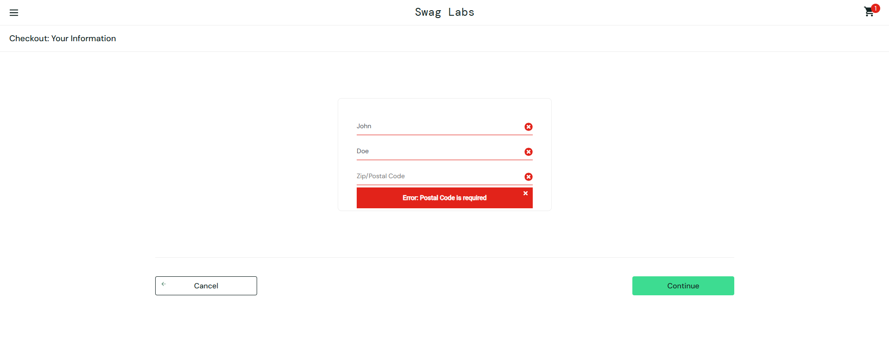

# Boundary Value Analysis Test Case - Postal Code

## Test Case ID:
BVA-001

## Related Requirement:
FR08 - User must fill in first name, last name, and postal code during checkout  
FR09 - System must validate required fields during checkout

## Title:
Validate minimum and maximum length for Postal Code in checkout

## Objective:
Verify that the system correctly handles minimum, maximum, and out-of-bound values for the Postal Code field during checkout.

## Preconditions:
- User is logged in on Sauce Labs Demo
- User has at least one product in the cart
- User is on the "Checkout: Your Information" page

## Test Steps:
1. Enter valid first name and last name.
2. Enter the Postal Code value as per the scenario.
3. Click the "Continue" button.

## Boundary Values:
| Scenario            | Input Postal Code | Expected Result                  |
|---------------------|------------------|----------------------------------|
| Minimum valid       | 1 digit          | Error: "Postal Code is required" |
| Just above minimum  | 2 digits         | Error: "Postal Code is required" |
| Typical valid       | 5 digits         | Proceed to next checkout step    |
| Maximum valid       | 10 digits        | Proceed to next checkout step    |
| Just above maximum  | 11 digits        | Error: "Postal Code is invalid"  |
| Empty               | (blank)          | Error: "Postal Code is required" |

## Postconditions:
- User proceeds to the next checkout step or sees a validation error.

## Evidence

### Valid Postal Code

### Invalid Postal Code

