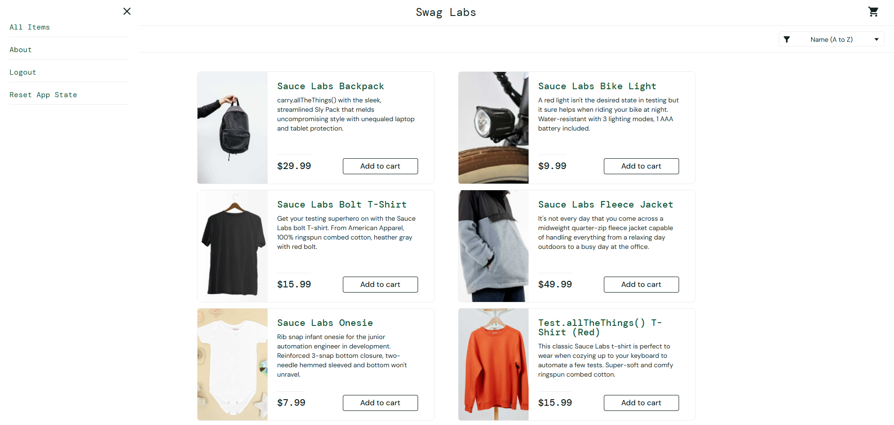
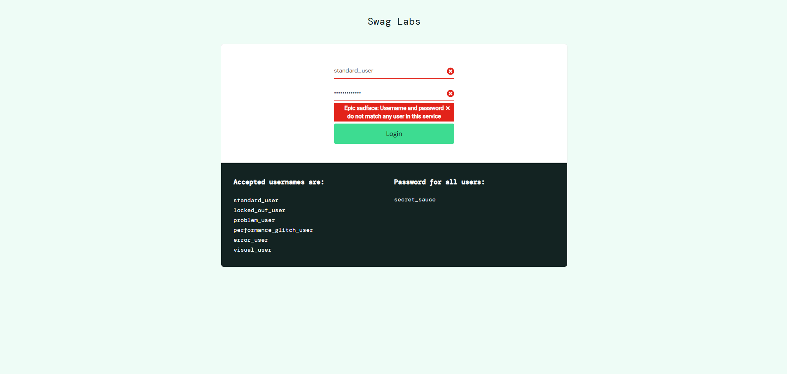

# Equivalence Partitioning Test Case - Login

## Test Case ID:
EP-001

## Related Requirement:
FR01 - User must be able to log in with valid credentials  
FR02 - System must display an error message for invalid login attempts

## Title:
Login with valid and invalid users

## Objective:
Verify that the system allows login for valid users and rejects invalid users.

## Preconditions:
- User is on the Sauce Labs login page: https://www.saucedemo.com/

## Test Steps:
1. Enter the username and password.
2. Click the "Login" button.

## Input Partitions:
| Partition Type | Input Username   | Input Password | Expected Result                   |
|----------------|-----------------|---------------|-----------------------------------|
| Valid          | standard_user   | secret_sauce  | Redirected to inventory page      |
| Invalid        | invalid_user    | secret_sauce  | Error message is displayed        |
| Invalid        | standard_user   | wrong_pass    | Error message is displayed        |

## Postconditions:
- User is either logged in or sees an error message.

## Evidence
### Valid Login

### Invalid Login
