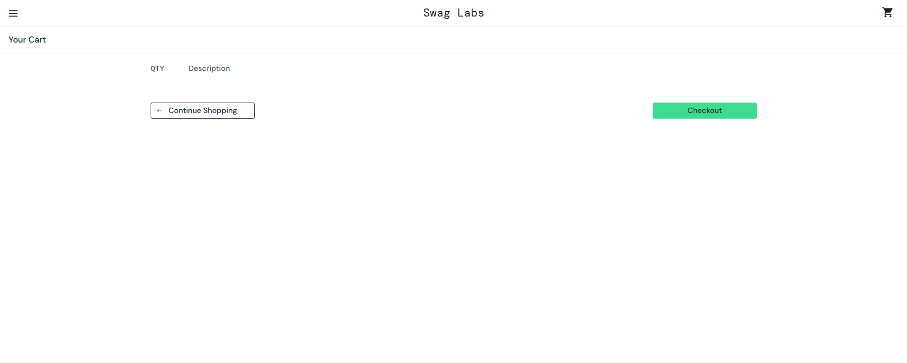
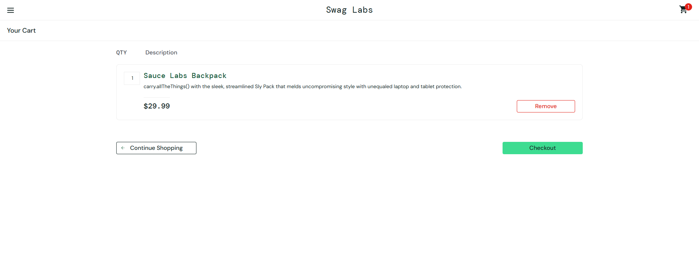
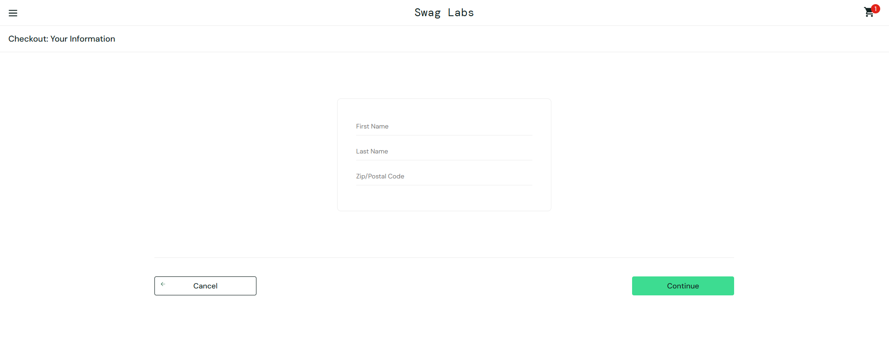

# State Transition Testing - Cart to Checkout Flow

## Test Case ID:
STT-001

## Related Requirements:
FR04 - User can add products to the cart  
FR05 - User can remove products from the cart  
FR06 - User can view cart items  
FR07 - User can start the checkout process  
FR10 - User can successfully complete a purchase

## Title:
Validate state transitions from cart to checkout and purchase completion

## Objective:
Verify that the system correctly handles state transitions from adding/removing items in the cart to completing a purchase.

## Preconditions:
- User is logged in on the demo site

## State Transitions:

| Current State   | Action                | Next State         | Expected Result                  |
|-----------------|----------------------|--------------------|----------------------------------|
| Empty Cart      | Add product          | Cart with items    | Product appears in cart          |
| Cart with items | Remove product       | Cart updated       | Product removed from cart        |
| Cart with items | View cart            | Cart page          | List of items displayed          |
| Cart with items | Start checkout       | Checkout Step One  | Checkout form displayed          |
| Checkout Step One | Complete form & continue | Checkout Step Two | Order summary displayed     |
| Checkout Step Two | Finish purchase    | Order Complete     | Confirmation message displayed   |

## Postconditions:
- User completes the purchase and sees a confirmation, or cart is updated accordingly.

## Evidence

### Empty Cart

### Cart with Item

### Checkout Page
